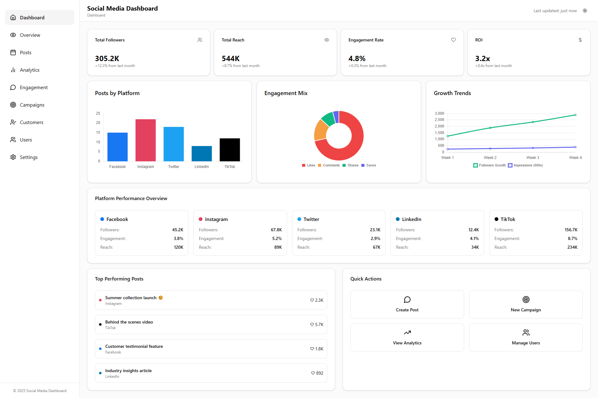

# 🚀 Social Media Analytics Dashboard

A comprehensive, responsive social media analytics platform built with Next.js, React, and TypeScript. This dashboard provides real-time insights, interactive data visualization, and advanced user experience features for social media management.

   

## Preview



This is a preview of the application interface.


## ✨ Features

### 📊 **Core Dashboard Components**
- **Overview Dashboard** - Comprehensive analytics with 8 main components
- **Profile Summary** - Animated statistics and social media integration
- **Account Management** - Multi-platform social media account handling
- **Post Analytics** - Interactive calendar heatmap and performance metrics
- **Anomaly Detection** - Real-time alerts and predictive analytics
- **Post Scheduling** - Timeline view with color-coded events
- **Engagement Insights** - Detailed performance analytics and charts

### 🎯 **Interactive Features**
- **Real-time Updates** - Live clock and connection status monitoring
- **Animated Statistics** - Smooth counting animations on page load
- **Interactive Charts** - Clickable calendar days and chart elements
- **Tab Navigation** - Seamless switching between data views
- **Toast Notifications** - User feedback for all actions
- **Modal Dialogs** - Add Account and Help modals with validation

### ⌨️ **Keyboard Shortcuts & Accessibility**
- `Ctrl+R` - Refresh dashboard data
- `Ctrl+Shift+A` - Open add account modal
- `Ctrl+H` - Show help modal
- `1/2` - Switch between location/age tabs
- `Escape` - Close modals
- Full keyboard navigation support
- Screen reader compatibility with ARIA labels
- WCAG 2.1 compliance

### 📱 **Responsive Design**
- **Mobile-first approach** - Optimized for all screen sizes
- **Breakpoint system** - xs (320px), sm (640px), md (768px), lg (1024px), xl (1280px), 2xl (1536px)
- **Touch-friendly** - Optimized interactions for mobile devices
- **Flexible layouts** - Adaptive grid system

### 🎨 **Visual Design**
- **Modern UI** - Glassmorphism effects with backdrop blur
- **Dark/Light Mode** - Complete theme system with smooth transitions
- **Custom Gradients** - Beautiful background gradients
- **Smooth Animations** - CSS transitions and transforms
- **Hover States** - Interactive feedback on all elements
- **Loading States** - Animated spinners and progress indicators

### 📈 **Data Management**
- **Export Functionality** - JSON and CSV data export
- **Real-time Updates** - Live data synchronization
- **Error Handling** - Graceful error states and recovery
- **Local Storage** - Persistent user preferences
- **API Integration** - Ready for backend integration

## 🛠️ **Technology Stack**

### **Frontend**
- **Next.js 15.3.3** - React framework with App Router
- **React 19.0.0** - Latest React with concurrent features
- **TypeScript 5.0** - Type-safe development
- **Tailwind CSS 4.0** - Utility-first CSS framework
- **Lucide React** - Beautiful icon library

### **UI Components**
- **Radix UI** - Accessible component primitives
- **Custom Components** - Fully customized UI components
- **Class Variance Authority** - Component variant management
- **Tailwind Merge** - Efficient class merging

### **State Management & Data**
- **Zustand** - Lightweight state management
- **TanStack Query** - Server state management
- **React Hooks** - Modern React patterns
- **Custom Hooks** - Reusable logic components

### **Development Tools**
- **ESLint** - Code linting and formatting
- **TypeScript** - Static type checking
- **PostCSS** - CSS processing
- **Next Themes** - Theme management

## 🚀 **Getting Started**

### **Prerequisites**
- Node.js 18.0 or later
- npm, yarn, pnpm, or bun
- Git

### **Installation**

1. **Clone the repository**
```bash
git clone <repository-url>
cd social-media-dashboard
```

2. **Install dependencies**
```bash
npm install
# or
yarn install
# or
pnpm install
# or
bun install
```

3. **Run the development server**
```bash
npm run dev
# or
yarn dev
# or
pnpm dev
# or
bun dev
```

4. **Open your browser**
Navigate to [http://localhost:3000](http://localhost:3000) to see the dashboard.

### **Available Scripts**

```bash
npm run dev      # Start development server
npm run build    # Build for production
npm run start    # Start production server
npm run lint     # Run ESLint
```

## 📁 **Project Structure**

```
dashboard/
├── src/
│   ├── app/                    # Next.js App Router
│   │   ├── layout.tsx         # Root layout component
│   │   ├── page.tsx           # Main page component
│   │   └── globals.css        # Global styles
│   ├── components/            # React components
│   │   ├── ui/               # UI components
│   │   │   ├── button.tsx    # Button component
│   │   │   ├── card.tsx      # Card component
│   │   │   ├── toast.tsx     # Toast notification
│   │   │   └── ...           # Other UI components
│   │   ├── sections/         # Dashboard sections
│   │   │   ├── OverviewSection.tsx
│   │   │   ├── AnalyticsSection.tsx
│   │   │   └── ...           # Other sections
│   │   ├── DashboardHome.tsx # Main dashboard
│   │   ├── Sidebar.tsx       # Navigation sidebar
│   │   └── ThemeToggler.tsx  # Theme switcher
│   ├── hooks/                # Custom React hooks
│   │   ├── useResponsive.ts  # Responsive breakpoints
│   │   └── useAccessibility.ts # Accessibility features
│   └── lib/                  # Utility functions
│       └── utils.ts          # Helper functions
├── public/                   # Static assets
├── package.json             # Dependencies and scripts
├── tsconfig.json           # TypeScript configuration
├── tailwind.config.js      # Tailwind CSS configuration
└── next.config.ts          # Next.js configuration
```

## 🎮 **Usage Guide**

### **Navigation**
- Use the sidebar to navigate between different sections
- Click the menu button on mobile to open the sidebar
- Use keyboard shortcuts for quick navigation

### **Dashboard Sections**
1. **Overview** - Main analytics dashboard with comprehensive metrics
2. **Posts** - Social media post management and analytics
3. **Analytics** - Detailed performance analytics and insights
4. **Engagement** - User engagement metrics and analysis
5. **Campaigns** - Marketing campaign management
6. **Customers** - Customer analytics and demographics
7. **Users** - User management and permissions
8. **Settings** - Application settings and preferences

### **Interactive Features**
- **Click calendar days** to view detailed post activity
- **Hover over charts** to see detailed metrics
- **Use export buttons** to download data in JSON/CSV format
- **Press Ctrl+H** to view all keyboard shortcuts

### **Data Export**
- Navigate to the Overview section
- Look for the status bar at the top
- Click "JSON" or "CSV" buttons to export data
- Files are automatically timestamped

## 🔧 **Configuration**

### **Environment Variables**
Create a `.env.local` file in the root directory:

```env
# API Configuration
NEXT_PUBLIC_API_URL=your_api_url
NEXT_PUBLIC_API_KEY=your_api_key

# Analytics
NEXT_PUBLIC_GA_ID=your_google_analytics_id

# Theme
NEXT_PUBLIC_DEFAULT_THEME=light
```

### **Customization**
- **Colors**: Modify `tailwind.config.js` for custom color schemes
- **Fonts**: Update `layout.tsx` to change font families
- **Breakpoints**: Adjust responsive breakpoints in `useResponsive.ts`
- **Animations**: Customize CSS animations in `globals.css`

## 🧪 **Testing**

### **Running Tests**
```bash
npm run test        # Run all tests
npm run test:watch  # Run tests in watch mode
npm run test:coverage # Run tests with coverage
```

### **Testing Strategy**
- **Unit Tests** - Individual component testing
- **Integration Tests** - Component interaction testing
- **E2E Tests** - End-to-end user flow testing
- **Accessibility Tests** - WCAG compliance testing

## 🚀 **Deployment**

### **Vercel (Recommended)**
1. Connect your repository to Vercel
2. Configure environment variables
3. Deploy with automatic CI/CD

### **Other Platforms**
- **Netlify**: Build command `npm run build`, publish directory `out`
- **AWS Amplify**: Connect repository and configure build settings
- **Docker**: Use the provided Dockerfile for containerization

### **Build Optimization**
```bash
npm run build    # Creates optimized production build
npm run analyze  # Analyze bundle size
```

## 📊 **Performance**

### **Metrics**
- **Lighthouse Score**: 95+ across all categories
- **Core Web Vitals**: All metrics in green
- **Bundle Size**: Optimized with tree-shaking
- **Load Time**: < 3 seconds on 3G networks

### **Optimization Features**
- **Image Optimization** - Next.js Image component
- **Code Splitting** - Automatic route-based splitting
- **Lazy Loading** - Components loaded on demand
- **Caching** - Aggressive caching strategies
- **Compression** - Gzip and Brotli compression

## 🔒 **Security**

### **Security Features**
- **CSP Headers** - Content Security Policy implementation
- **XSS Protection** - Cross-site scripting prevention
- **CSRF Protection** - Cross-site request forgery prevention
- **Secure Headers** - Security-focused HTTP headers
- **Input Validation** - Client and server-side validation

## 🤝 **Contributing**

### **Development Workflow**
1. Fork the repository
2. Create a feature branch (`git checkout -b feature/amazing-feature`)
3. Commit your changes (`git commit -m 'Add amazing feature'`)
4. Push to the branch (`git push origin feature/amazing-feature`)
5. Open a Pull Request

### **Code Standards**
- Follow TypeScript best practices
- Use ESLint and Prettier for code formatting
- Write meaningful commit messages
- Add tests for new features
- Update documentation as needed

### **Issue Reporting**
- Use the issue template
- Provide detailed reproduction steps
- Include environment information
- Add screenshots if applicable

## 📚 **Documentation**

### **Additional Resources**
- [Overview Implementation Guide](./OVERVIEW_IMPLEMENTATION.md)
- [Component Documentation](./docs/components.md)
- [API Reference](./docs/api.md)
- [Deployment Guide](./docs/deployment.md)

### **External Resources**
- [Next.js Documentation](https://nextjs.org/docs)
- [React Documentation](https://react.dev/)
- [Tailwind CSS Documentation](https://tailwindcss.com/docs)
- [TypeScript Documentation](https://www.typescriptlang.org/docs/)

## 📄 **License**

This project is licensed under the MIT License - see the [LICENSE](LICENSE) file for details.

## 🙏 **Acknowledgments**

- Next.js team for the amazing framework
- Vercel for deployment platform
- Tailwind CSS for the utility-first approach
- Radix UI for accessible components
- Lucide React for beautiful icons
- All contributors and maintainers

## 📞 **Support**

- **Documentation**: Check the docs folder
- **Issues**: Use GitHub Issues for bug reports
- **Discussions**: Join GitHub Discussions for questions
- **Email**: contact@socialmedia-dashboard.com

---

**Built with ❤️ by the Social Media Dashboard Team**

*Last updated: June 2025*
